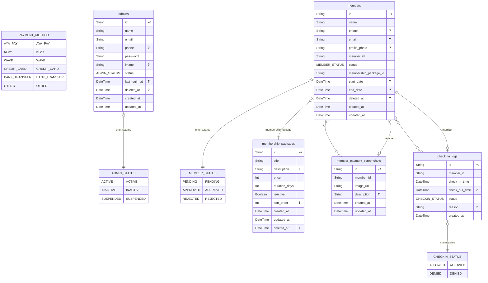

```mermaid
erDiagram

        CHECKIN_STATUS {
            ALLOWED ALLOWED
DENIED DENIED
        }
    


        ADMIN_STATUS {
            ACTIVE ACTIVE
INACTIVE INACTIVE
SUSPENDED SUSPENDED
        }
    


        PAYMENT_METHOD {
            AYA_PAY AYA_PAY
KPAY KPAY
WAVE WAVE
CREDIT_CARD CREDIT_CARD
BANK_TRANSFER BANK_TRANSFER
OTHER OTHER
        }
    


        MEMBER_STATUS {
            PENDING PENDING
APPROVED APPROVED
REJECTED REJECTED
        }
    
  "admins" {
    String id "🗝️"
    String name 
    String email 
    String phone "❓"
    String password 
    String image "❓"
    ADMIN_STATUS status 
    DateTime last_login_at "❓"
    DateTime deleted_at "❓"
    DateTime created_at 
    DateTime updated_at 
    }
  

  "members" {
    String id "🗝️"
    String name 
    String phone "❓"
    String email "❓"
    String profile_photo "❓"
    String member_id 
    MEMBER_STATUS status 
    String membership_package_id 
    DateTime start_date "❓"
    DateTime end_date "❓"
    DateTime deleted_at "❓"
    DateTime created_at 
    DateTime updated_at 
    }
  

  "membership_packages" {
    String id "🗝️"
    String title 
    String description "❓"
    Int price 
    Int duration_days 
    Boolean isActive 
    Int sort_order "❓"
    DateTime created_at 
    DateTime updated_at 
    DateTime deleted_at "❓"
    }
  

  "member_payment_screenshots" {
    String id "🗝️"
    String member_id 
    String image_url 
    String description "❓"
    DateTime created_at 
    DateTime updated_at 
    }
  

  "check_in_logs" {
    String id "🗝️"
    String member_id 
    DateTime check_in_time 
    DateTime check_out_time "❓"
    CHECKIN_STATUS status 
    String reason "❓"
    DateTime created_at 
    }
  
    "admins" o|--|| "ADMIN_STATUS" : "enum:status"
    "members" o|--|| "MEMBER_STATUS" : "enum:status"
    "members" o|--|| "membership_packages" : "membershipPackage"
    "members" o{--}o "member_payment_screenshots" : ""
    "members" o{--}o "check_in_logs" : ""
    "member_payment_screenshots" o|--|| "members" : "member"
    "check_in_logs" o|--|| "CHECKIN_STATUS" : "enum:status"
    "check_in_logs" o|--|| "members" : "member"
```
